# Artifactory - NFT Marketplace

Welcome to Artifactory, an exclusive NFT marketplace where users can mint, view, list, and purchase NFTs, complete with creator royalties on resales. This project includes both Solidity smart contract development and front-end integration.

You can access the deployed app here:

https://nft-marketplace-react-4bflr874v-lightningnemesis-projects.vercel.app/home

## Project Overview

### Smart Contract (ERC-721):

• A custom ERC-721 smart contract written in Solidity.
• Supports minting, listing, and purchasing NFTs.
• Includes royalty functionality, so original creators earn royalties on each resale.

Front-End:

• Developed using React and Ethers.js for blockchain interaction.
• Users can connect their wallet, mint NFTs, view marketplace listings, and make purchases.

Deployment:

• The smart contract is deployed on the `Skopje testnet` using Hardhat.

• Details about the ERC721 smart contract and the available functions are listed on the smart contract repo
https://github.com/LightningNemesis/NFT-Marketplace

Features

1. Mint NFTs: Easily mint NFTs directly through the front-end.
2. List NFTs for Sale: Place NFTs for sale on the marketplace.
3. Buy NFTs: Browse listings and make purchases directly.
4. Creator Royalties: Ensure that original creators receive a royalty on resales.
5. Wallet Connection: Seamlessly connect your wallet and manage digital assets.

### Setup and Installation

Installation Steps

Prerequisites

    •	Node.js & Yarn
    •	MetaMask or another Ethereum wallet
    •	Hardhat

1. Clone the repository:

```
git clone https://github.com/LightningNemesis/NFT-Marketplace-React-App.git
cd NFT-Marketplace-React-App
```

2. Install dependencies with Yarn:

```
yarn install
```

3. Set up environment variables:

Create a .env file in the root directory and add your environment variables:

```
REACT_APP_CONTRACT_ADDRESS=0xaaaaaa
REACT_APP_RPC_URL=https://skopje-rpc.gptprotocol.io

# We are using Pinata for ipfs, change it as required
REACT_APP_PINATA_API_KEY=0xaaaaaa
REACT_APP_PINATA_API_SECRET=0xaaaaaa
```

4. Start the front-end:

```
yarn start
```

### Running the Project

After completing the setup, you can launch the front-end application:

    •	Navigate to http://localhost:3000.

    •	Connect your wallet and start exploring the marketplace.

#### Connecting to wallet

We will need to click on the Connect Wallet icon on the top right

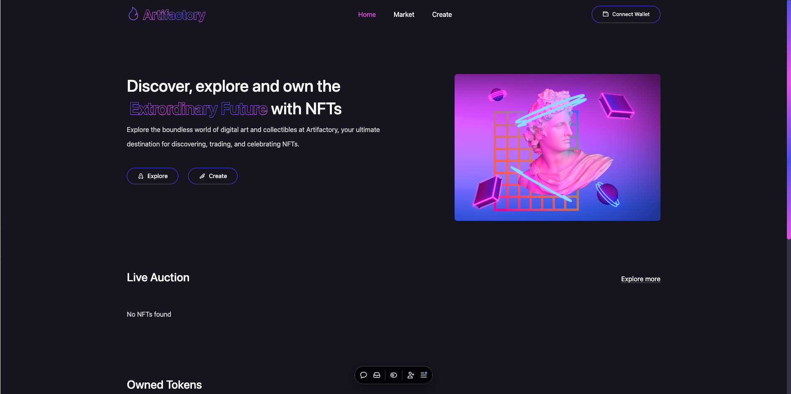

Click on the metamask brower extension & allow connections to all wallets you wish to connect

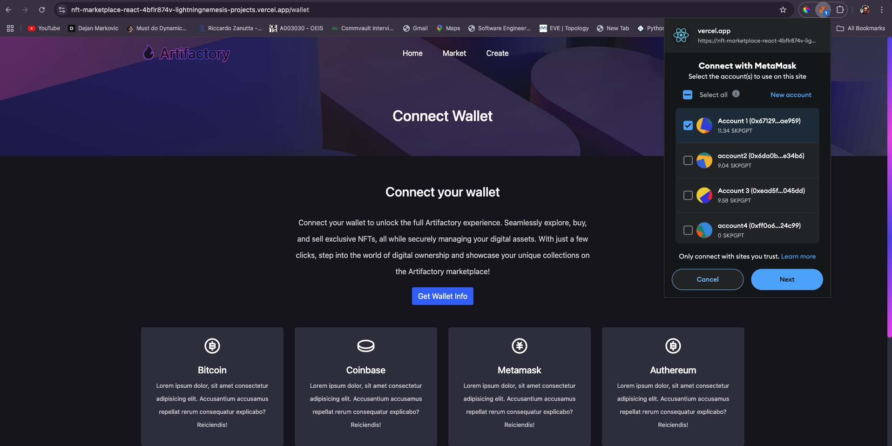

Grant Permissions

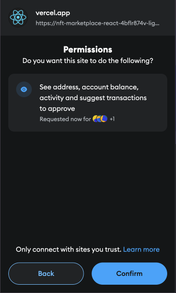

You will see your wallet connected and a `random generated name` will be assigned to it (eg. Wise Tiger)

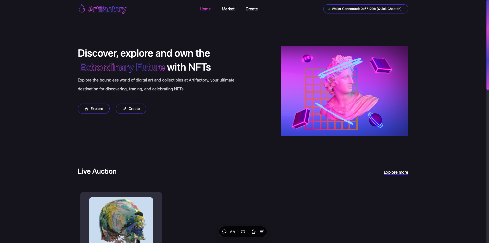

#### Navigating the app

##### Live Auction & Owned NFT sections

We have the home page which contains the `Live Auction` and `Owned NFTs` section

Clicking on the NFT's name will take us to the details page, which contains the following information:

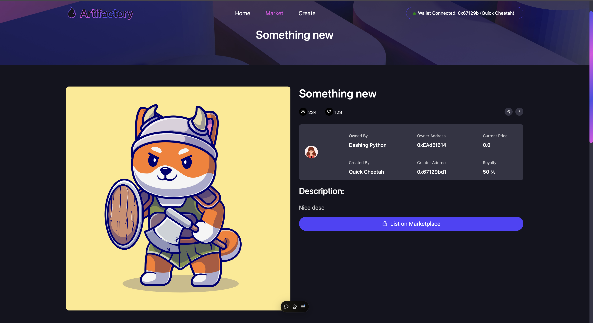

1. Owned by: Current owner of the NFT
2. Created by: Creator owner of the NFT
3. Owner address: Wallet address for the owner
4. Creator address: Wallet address for the creator
5. Current Price: Price at which the NFT is listed on the `Live Auction` section
6. Royalty: Percentage of the sale price which is sent by the smart contract to the creator

##### Create NFT page

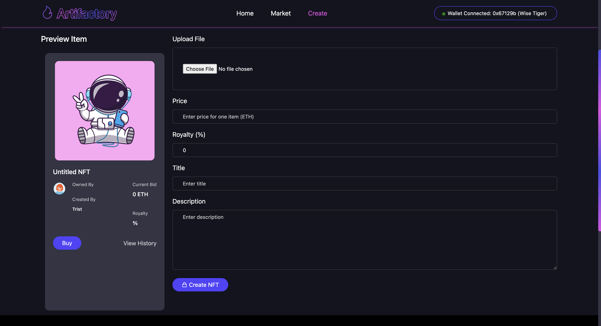

Users need to enter the following details for creating an NFT

1. Image (will be uploaded for ipfs which returns a token URI containing the NFT metadata)
2. Price
3. Royalty (in percentage) [value entered will be a number]
4. Title
5. Description for the NFT

Note: An error will be thrown if any of the fields are missing

    Once user enters all the details for the NFT, click on the `Create NFT` button

This will ask you to approve 2 transactions from your wallet:

- Minting the NFT
- Listing the NFT on the marketplace

Post the listing is successful, we see a success `toast` and we can check the newly created NFT on the `Home Page` > `Live Auction` section

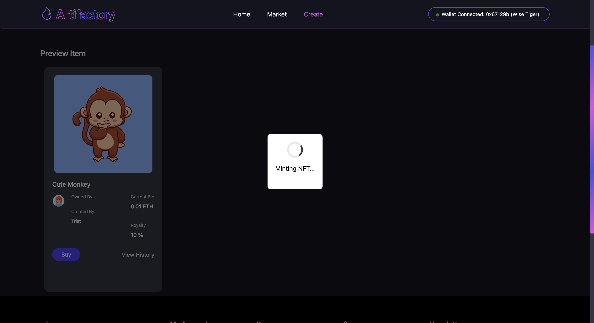
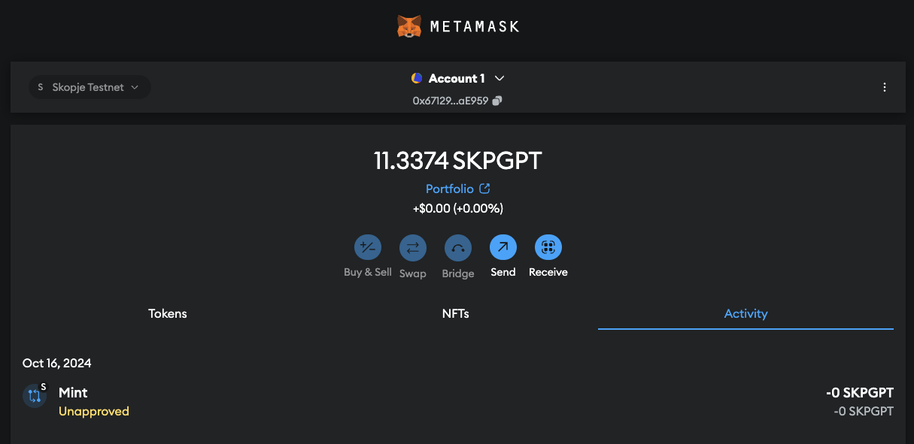
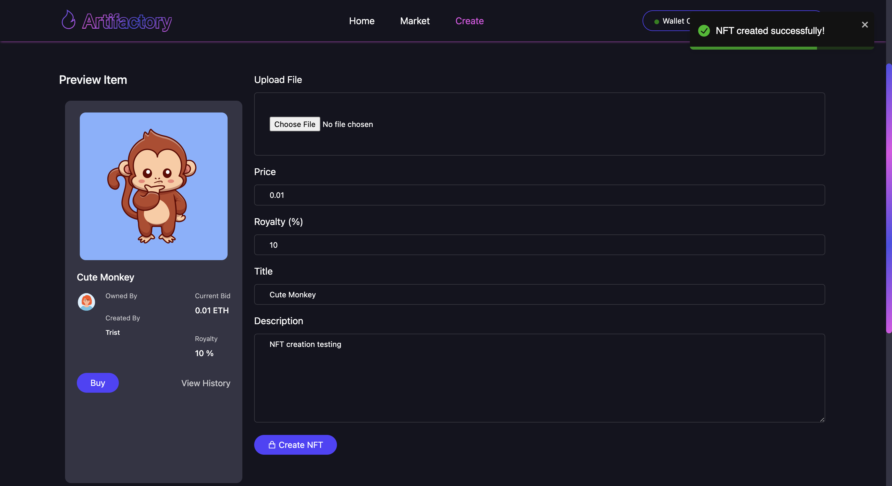

Post minting & listing, NFT is listed on the Home page
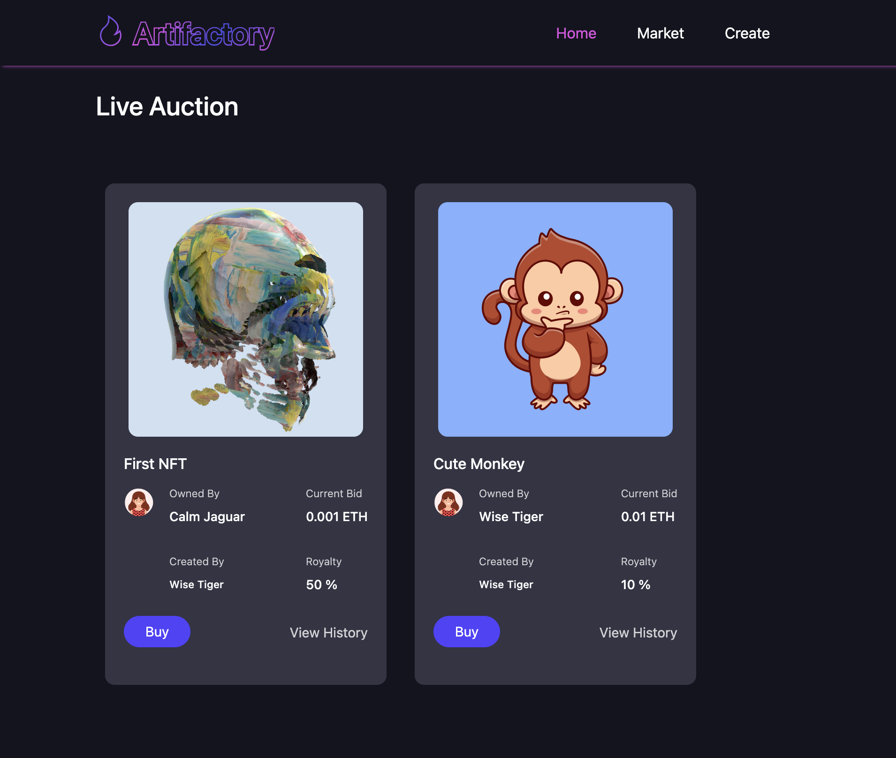

### Buying an NFT

From the NFTs listed on the `live auction` section, click on `Buy` button

This will initiate a transaction on your wallet and will transfer ownership from the current owner to you

This will also send the `royalty %` of the sale to the creator of the nft, as implemented in the smart contract logic.

### Listing an owned NFT on marketplace

- Scroll down to the `Owned NFTs` section in the `Home` page

- Click on `List on Marketplace` button

- Enter a price value for listing the NFT

- Click on `List on Marketplace` button in the modal

This will list the NFT on the market place again

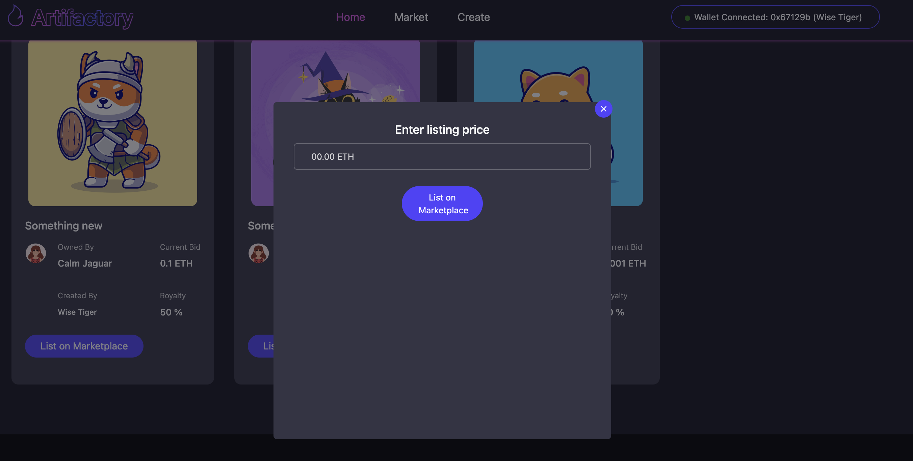
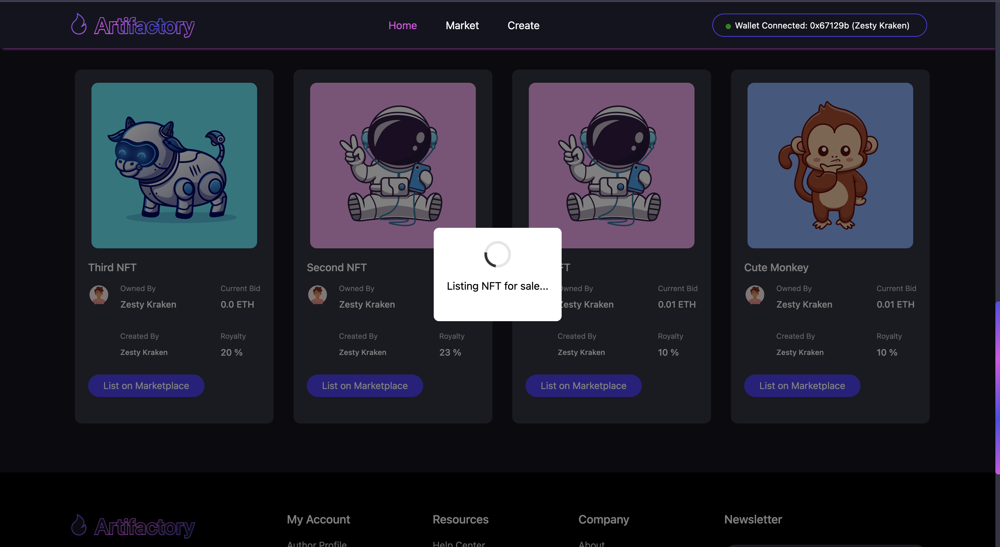

### Future work & Bugs

- Upon reloading, sometimes the wallet information is lost or becomes stale. Please try switching accounts on your wallet as this emits an event which our React app listens to and the wallet/NFT details are fetched again.
  An alternative is to repeat the `connect wallet` steps again.

- Display of alert toasts for buy operations are unreliable. Please check the wallet or explorer for confirmation of listing and buying operations if the front-end doesn't reflect the changes.

- Grouping/Sorting of listed NFTs on the market page does not work currently.
